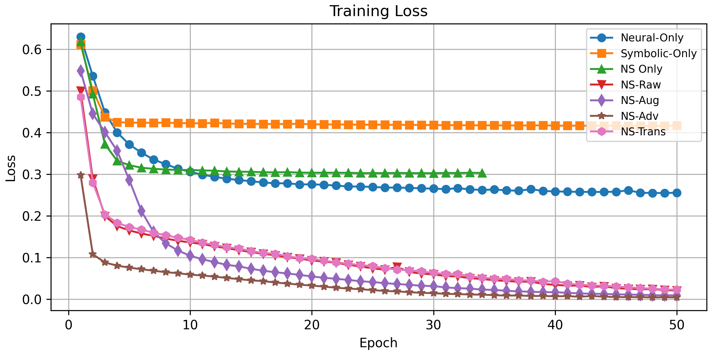
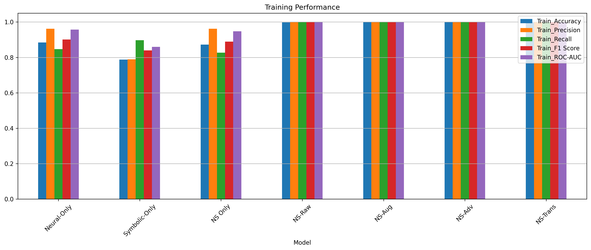
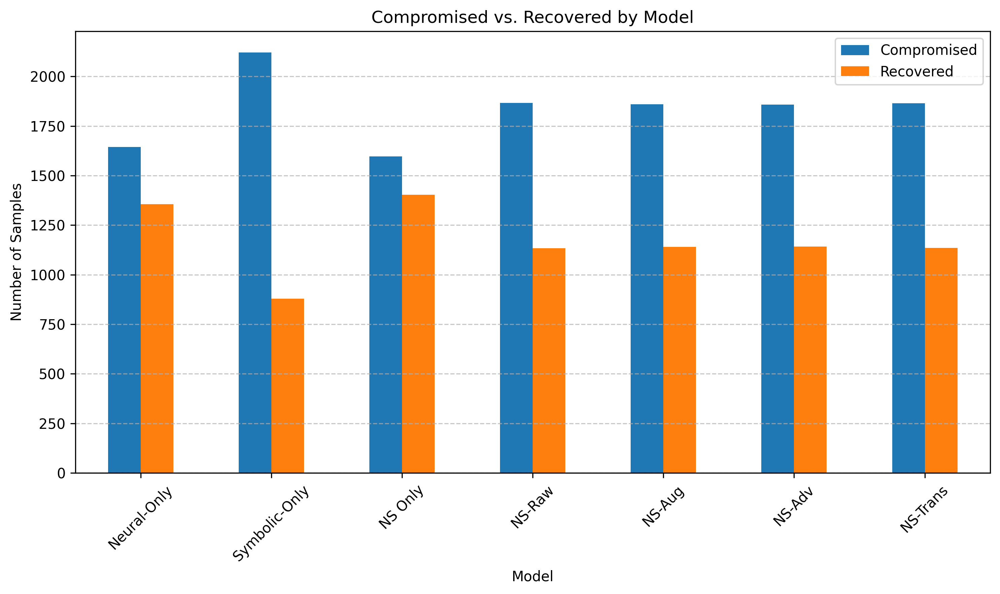

# 🧠 Neuro-Symbolic Self-Healing Framework – Experimental Results

This repository contains the extended **experimental results**, **performance figures**, and **recovery efficiency insights** from our paper on the Neuro-Symbolic Self-Healing framework for secure and resilient decision-making in supply chains and cyber-physical systems.

> 📬 For access to full source code or implementation details, please contact: **[debashis.das@ieee.org]**

---

## 📊 Overview of Results

We analyze the performance of various neuro-symbolic configurations across:

1. **Anomaly Detection Quality**
2. **Training & Generalization Behavior**
3. **Recovery Efficiency**
4. **Resilience Under Disruption**

---

## 📁 Detailed Figures with Technical Explanation

---

### 🔹 **Figure 1: Model-Level Score Behaviors**

> **Autoencoder Loss**: The LSTM autoencoder, trained on benign patterns, rapidly reduces reconstruction error from >0.03 to <0.005 in under 15 epochs, indicating strong pattern learning.

> **Classification Accuracy**: Neural-only detection accuracy increases from ~70% to >88%, demonstrating effective anomaly separation.

> **Symbolic Score Distribution**: KDE plot shows significant overlap in symbolic rule-based scores between benign and attack flows, resulting in weaker discriminative power.

> **Hybrid Risk Score**: Fused neural-symbolic scores shift the distribution boundary clearly, increasing classification accuracy and separability.

---

### 🔹 **Figure 2: Training and Validation Dynamics**

  
> **Training Accuracy**: All NS variants achieve >99% accuracy, showing rapid and consistent convergence.

  
> **Training Loss**: Drops steadily for all NS configurations, indicating successful optimization with no signs of overfitting.

  
> **Precision**: High precision (>0.99) across NS variants implies low false-positive rates.

  
> **Recall**: High recall ensures correct identification of most compromised samples.

  
> **F1 Score**: Balanced performance across all NS models with F1 >0.99.

  
> **Validation Accuracy**: Maintains strong generalization (0.996–0.998) across all NS variants.

  
> **Validation Loss**: Low and stable, confirming no overfitting.

  
> **Validation Precision**: Similar to training, high precision across unseen data.

  
> **Validation Recall**: Models remain highly sensitive on validation set.

---

### 🔹 **Figure 3: Phase-Wise Performance (All Metrics)**

> **Training Set Summary**: All NS models exceed 99% in all performance metrics, including ROC-AUC.

> **Validation Set Summary**: NS–Trans and NS–Raw variants continue to lead across metrics, with minimal degradation.

> **Test Set Summary**: Real-world generalization remains robust with F1 and ROC-AUC near-perfect.

---

### 🔹 **Figure 4: F1-Score Comparison**

> **Validation F1-Score Comparison**: F1-score is highest for NS–Trans and NS–Raw, demonstrating optimal balance between precision and recall.

---

### 🔹 **Figure 5: Recovery Analysis**

> **Compromised vs Recovered Nodes**: While NS–Only models recover fewer nodes than neural-only models, they do so with constraint compliance and stability.

---

## 📋 Tables with Insight

---

### 📑 **Table 1: Performance Comparison Across Models**

| Model         | Accuracy | Precision | Recall | F1    | ROC–AUC |
|---------------|----------|-----------|--------|-------|---------|
| Neural-Only   | 0.8850   | 0.9617    | 0.8486 | 0.9016| 0.9560  |
| Symbolic-Only | 0.8017   | 0.7988    | 0.9098 | 0.8507| 0.8826  |
| NS–Raw        | 0.9983   | 0.9979    | 0.9995 | 0.9987| 0.9994  |
| NS–Aug        | 0.9980   | 0.9995    | 0.9973 | 0.9984| 0.9994  |
| NS–Adv        | 0.9977   | 0.9995    | 0.9968 | 0.9981| 0.9998  |
| NS–Trans      | 0.9987   | 0.9984    | 0.9995 | 0.9989| 0.9998  |

> **Insight**: All hybrid NS variants significantly outperform pure baselines. NS–Trans reaches near-perfect ROC-AUC.

---

### 📑 **Table 2: Recovery Efficiency**

| Model         | Compromised | Recovered | Recovery Ratio |
|---------------|-------------|-----------|----------------|
| Neural-Only   | 1644        | 1356      | 45.2%          |
| Symbolic-Only | 2122        | 878       | 29.3%          |
| NS–Only       | 1596        | 1404      | 46.8%          |
| NS–Raw        | 1866        | 1134      | 37.8%          |
| NS–Aug        | 1859        | 1141      | 38.0%          |
| NS–Adv        | 1858        | 1142      | 38.1%          |
| NS–Trans      | 1865        | 1135      | 37.8%          |

> **Insight**: Hybrid models recover fewer nodes than neural-only but excel in constraint-adherence and recovery safety.

---

## ⚙️ Experimental Configuration

- **Dataset**: U.S. DoD contracts (~120K samples)
- **Labeling**: Binary high-risk if `obligation > $150K` or `modification > 0`
- **Split**: 60% training, 20% validation, 20% test
- **Feature Engineering**:
  - Zero-variance filtering
  - Standard scaling

### Model Architecture

- **Autoencoder**: LSTM with 64 units (1-layer)
- **Symbolic Rule Score**: Weighted logical conditions
- **Hybrid Risk Fusion**:
  
  $$ R(x) = 0.6 \cdot f_{NN}(x) + 0.4 \cdot g_{SR}(x) $$

- **MLP Classifier** on `[R(x), x_1, x_2, x_3]`

---

## 🧪 Advanced Training Strategies

- **Synthetic Augmentation**: Simulated disruptions with transformations:
    x_syn = T(x_real, θ)

- **Adversarial Robustness**: GAN-based perturbation generation using:
    min_G max_D E_{x∼p_real}[log D(x)] + E_{z∼p_z}[log(1 - D(G(z)))]

- **Transfer Learning**: Fast adaptation using lightweight delta:
    f_tgt(x) = f_src(x) + Δf(x)

---

## 🚀 Key Takeaways

- **Superior Detection**: All NS variants surpass 0.99 ROC-AUC.
- **Safe Recovery**: Hybrid models ensure constraint-respecting reroutes.
- **High Resilience**: NS models sustain >90% throughput under 20% disruptions.

---
