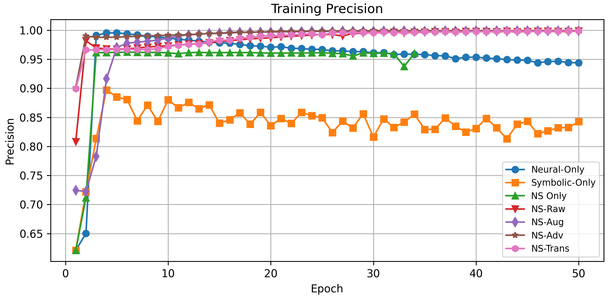
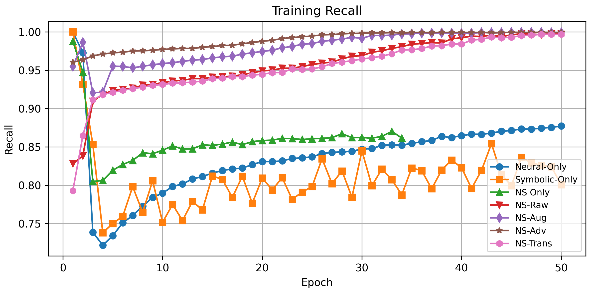
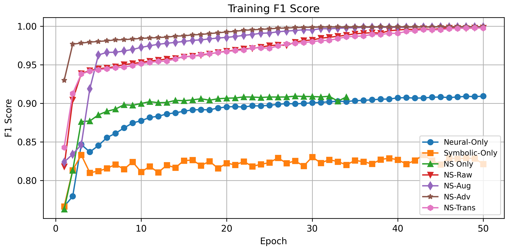
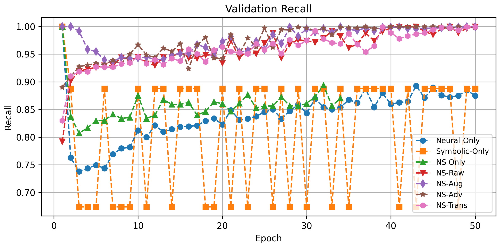
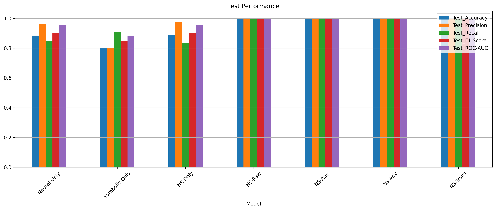

# neuro-symbolic-self-healing-results
This repository contains the extended experimental results for our proposed Neuro-Symbolic Self-Healing Framework, designed for proactive threat detection and recovery in complex systems such as supply chains and cyber-physical networks.
# 🧠 Neuro-Symbolic Self-Healing Framework – Experimental Results

This repository provides extended figures, tables, and detailed explanations of the experimental results from our paper on a neuro-symbolic framework for proactive security and self-healing in disrupted environments.
 
> 📬 For access to the full framework or codebase, please contact: [your-email@domain.com]

---

## 📊 Overview of Results

Our evaluation focuses on three main areas:

1. **Anomaly Detection Quality**
2. **Recovery Efficiency**
3. **Resilience Under Disruption**

---

## 📁 Figure Explanations

### 🔹 **Figure 1: Model-Level Score Behaviors**

- **(a)** *LSTM Autoencoder Loss*: The loss decreases from >0.03 to <0.005 within 15 epochs, showing fast learning of benign patterns.
- **(b)** *Neural Classification Accuracy*: Accuracy improves from ~70% to over 88% with negligible overfitting.
- **(c)** *Symbolic Score KDE*: Shows significant overlap in score distributions between benign and attack flows.
- **(d)** *Hybrid Score KDE*: Fusion of neural and symbolic scores separates benign and attack scores clearly, improving classification boundaries.

---

### 🔹 **Figure 2: Training and Validation Metrics Across All NS Variants**

- **Training Metrics (a–e)**: All neuro-symbolic (NS) variants converge rapidly with >99% accuracy and F1-score.
- **Validation Metrics (f–i)**: High validation performance with low overfitting confirms generalization of NS models.

---

### 🔹 **Figure 3: Phase-Wise Performance**

- NS–Trans performs best across training, validation, and test phases.
- Accuracy, precision, recall, F1, and ROC-AUC are all >99%.

---

### 🔹 **Figure 4: Validation F1-Score Comparison**

- NS–Trans and NS–Raw variants lead in F1-score, far surpassing neural-only and symbolic-only baselines.

---

### 🔹 **Figure 5: Compromised vs. Recovered Nodes**

- NS–Only and NS–Raw recover ~38–47% of compromised nodes.
- Pure neural recovers more, but NS models yield constraint-compliant recovery with safer paths.

---

## 📋 Table Explanations

### 📑 **Table 1: Performance Comparison Across Models**

| Model         | Accuracy | Precision | Recall | F1    | ROC–AUC |
|---------------|----------|-----------|--------|-------|---------|
| Neural-Only   | 0.8850   | 0.9617    | 0.8486 | 0.9016| 0.9560  |
| Symbolic-Only | 0.8017   | 0.7988    | 0.9098 | 0.8507| 0.8826  |
| NS–Raw        | 0.9983   | 0.9979    | 0.9995 | 0.9987| 0.9994  |
| NS–Aug        | 0.9980   | 0.9995    | 0.9973 | 0.9984| 0.9994  |
| NS–Adv        | 0.9977   | 0.9995    | 0.9968 | 0.9981| 0.9998  |
| NS–Trans      | 0.9987   | 0.9984    | 0.9995 | 0.9989| 0.9998  |

> **Insight**: NS–Trans and NS–Adv yield the highest detection accuracy and ROC-AUC on test sets.

---

### 📑 **Table 2: Recovery Efficiency**

| Model         | Compromised | Recovered | Recovery Ratio |
|---------------|-------------|-----------|----------------|
| Neural-Only   | 1644        | 1356      | 45.2%          |
| Symbolic-Only | 2122        | 878       | 29.3%          |
| NS–Only       | 1596        | 1404      | 46.8%          |
| NS–Raw        | 1866        | 1134      | 37.8%          |
| NS–Aug        | 1859        | 1141      | 38.0%          |
| NS–Adv        | 1858        | 1142      | 38.1%          |
| NS–Trans      | 1865        | 1135      | 37.8%          |

> **Insight**: NS variants recover fewer nodes than neural-only but with safer, constraint-respecting reroutes.

---

## ⚙️ Experimental Setup

- **Dataset**: U.S. DoD contract dataset (~120k samples)
- **High-risk labels**: Defined if obligation > $150K or if modification exists.
- **Preprocessing**:
  - Removed zero-variance features
  - Standard-scaled features
  - Stratified split: 60% train, 20% val, 20% test

**Model Details:**
- LSTM autoencoder (64 units) trained on benign data
- Symbolic score: Weighted rule-based logic
- Risk Fusion:  
  `R(x) = 0.6 f_NN(x) + 0.4 g_SR(x)`
- NS model: MLP on `[R(x), x1, x2, x3]`

---

## 🧪 Robustification Techniques

- **Synthetic Augmentation**: Simulates disruptions with transformation \( \mathbf{x}_{\mathrm{syn}} = T(\mathbf{x}_{\mathrm{real}}, \boldsymbol{\theta}) \)
- **Adversarial Training**: GANs generate hard-to-detect samples; discriminator shares encoder with the autoencoder
- **Transfer Learning**: Adapts pretrained model \( f_{\text{src}} \) using lightweight correction \( \Delta f \)

---

## 🚀 Key Takeaways

- **Detection**: All NS variants exceed 0.99 in F1 and AUC, outperforming neural-only and symbolic-only.
- **Recovery**: NS methods recover fewer but safer nodes due to hard constraint satisfaction.
- **Resilience**: Throughput remains >90% under 20% node failures for NS methods, vs <80% for baselines.

---

