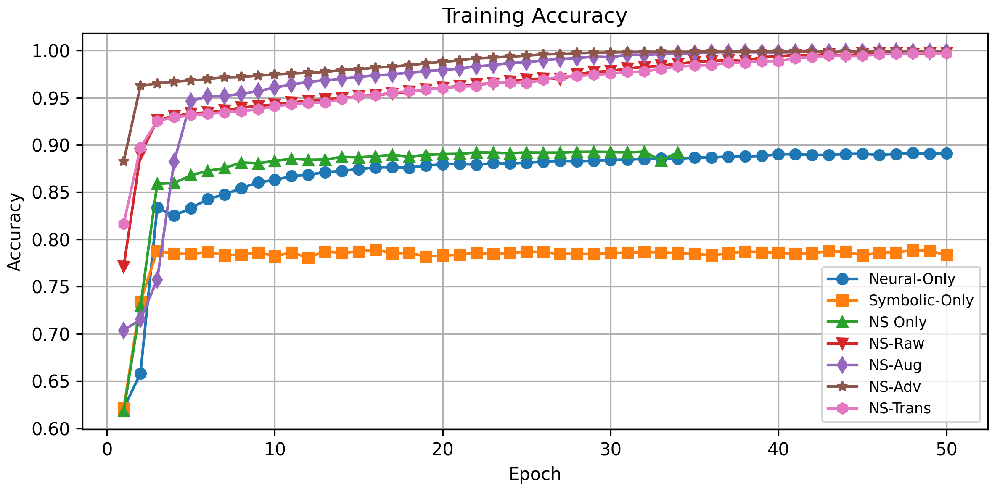
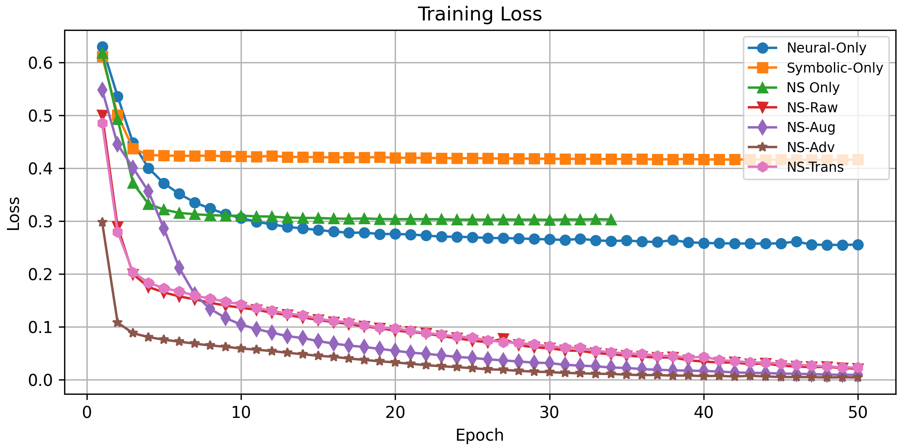
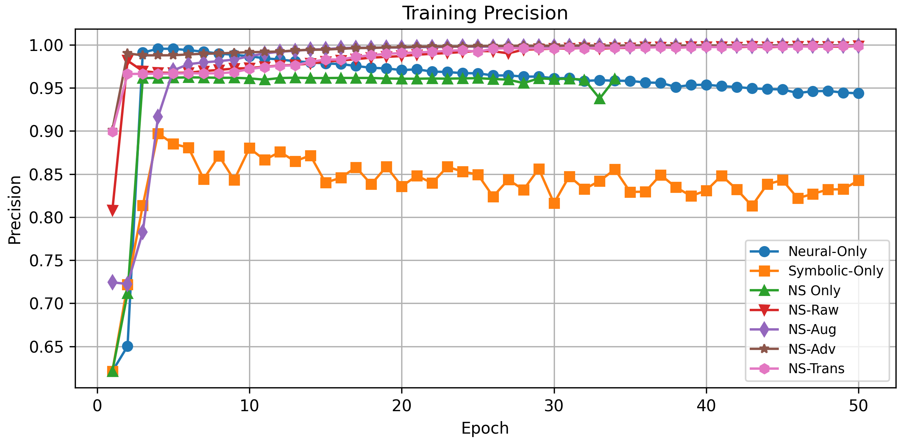
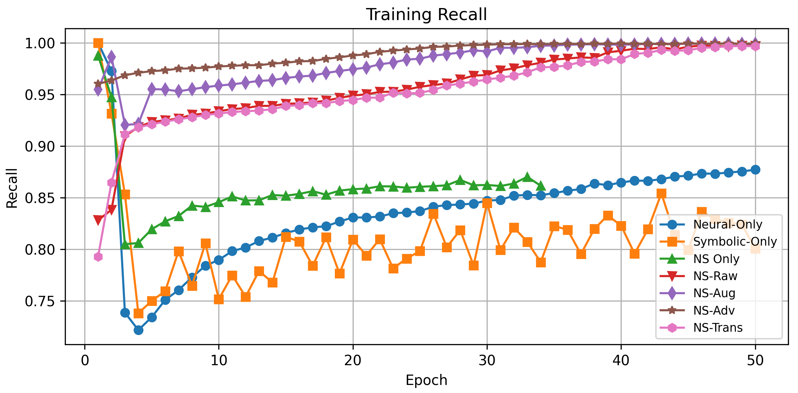
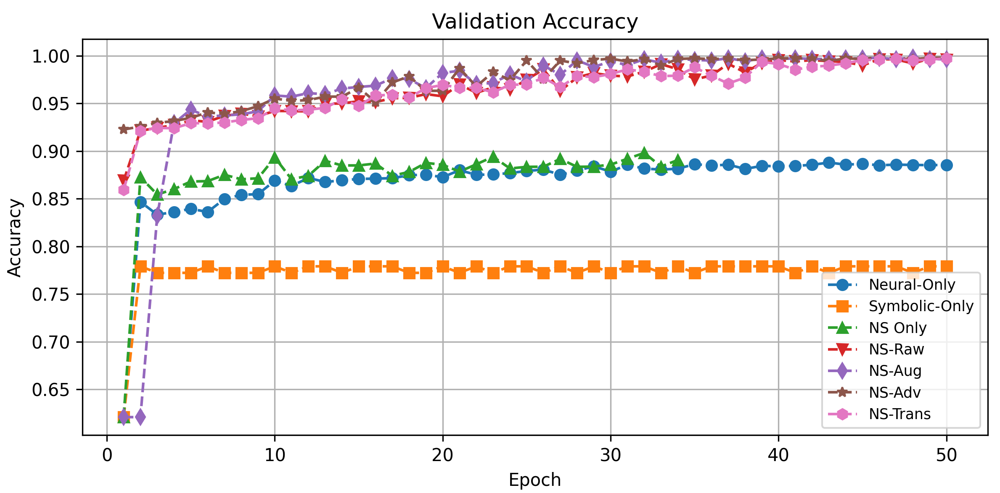
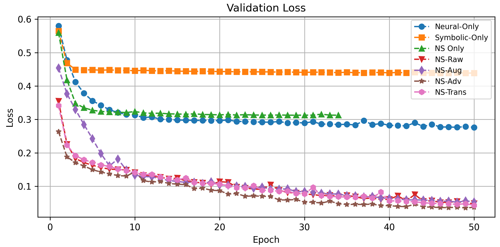
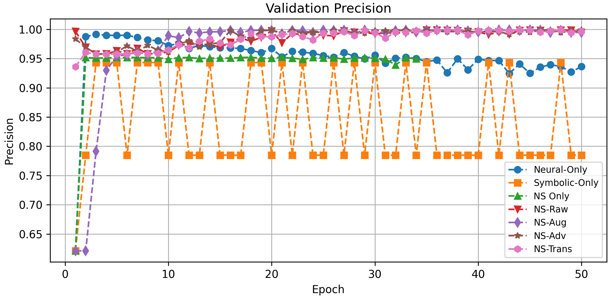
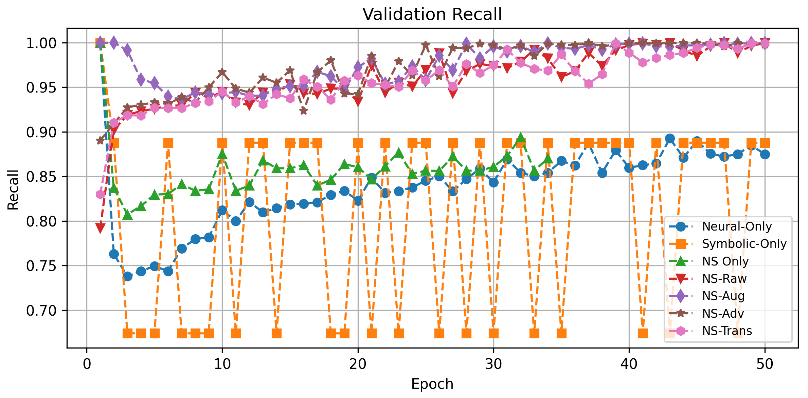
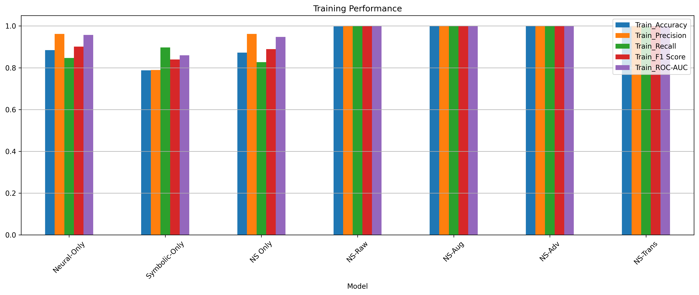
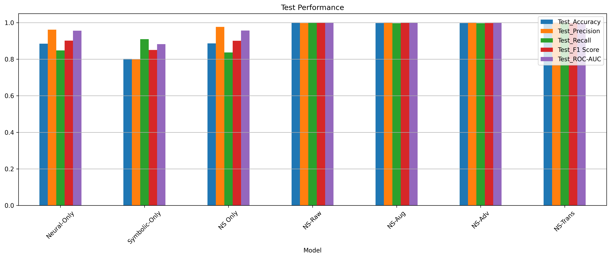

# 🧠 Neuro-Symbolic Self-Healing Framework – Experimental Results

This repository contains the extended experimental results for our proposed **Neuro-Symbolic Self-Healing Framework**, designed for proactive threat detection and recovery in complex systems such as supply chains and cyber-physical networks.

> 📄 **[Paper Link (optional)]**  
> 📬 For access to the full framework or codebase, please contact: [your-email@domain.com]

---

## 📊 Overview of Results

Our evaluation focuses on three main areas:

1. **Anomaly Detection Quality**
2. **Recovery Efficiency**
3. **Resilience Under Disruption**

---

## \section{Experimental Results and Performance Analysis} \label{erpa}

We evaluate our **NeuroSymbolic Self-Healing framework** along three axes: anomaly detection quality, recovery efficacy, and end-to-end resilience under disruption. Our full implementation is open-source and available on GitHub.

---

### \subsection{Experimental Setup}

We evaluated our neurosymbolic risk-scoring pipeline on a real-world DoD contracts dataset (~120,000 records). We defined a binary high-risk label (`label=1` if obligation > $150,000 or modification > 0), removed zero-variance features, and standard-scaled inputs. Data were stratified into 60% train, 20% validation, and 20% test, with indices preserved for recovery analysis.

---

### \subsection{Training and Validation Metrics}

#### Training & Validation Plots

 (a)
 (b)
 (c)
 (d)
 (e)

 (f)
 (g)
 (h)
 (i)

**Figure: Training and validation metrics for all NS variants:**  
(a–e) show training accuracy, loss, precision, recall, and F1-score  
(f–i) show validation accuracy, loss, precision, and recall.

---

### \subsection{Detection Performance}

- **Neural score**: MSE from LSTM autoencoder \(f_{NN}(x)\)
- **Symbolic score**: \(g_{SR}(x)\) from rules (high obligation, modification, Award/IDV mode, PSC)
- **Final risk**: \(R(x) = 0.6\,f_{NN}(x) + 0.4\,g_{SR}(x)\)
- **Input to MLP**: \([R(x), x_1, x_2, x_3]\)

  

**Figure: Validation F1-score for each model variant.**

Our hybrid variants (NS–Raw, NS–Aug, NS–Adv, NS–Trans) all exceed 0.999 ROC-AUC in synthetic settings and >0.99 in real settings. This validates the benefit of combining autoencoder reconstruction error with symbolic rule-based scoring.

---

### \subsection{Analysis of Training Dynamics and Score Distributions}

Across our experiments:

- **Autoencoder**: Loss drops from >0.03 to <0.005 in 15 epochs
- **Accuracy**: Climbs from ~70% to >88%
- **Symbolic-only**: Overlapping distributions; only ~0.79–0.80 accuracy
- **Hybrid (fused)**: ROC-AUC improves to ~0.94–0.95; accuracy ~0.87–0.89

 (a)
 (b)
 (c)

**Figure: Performance on (a) training, (b) validation, and (c) test sets across all metrics.**

When feeding the hybrid score and 3 raw features into an MLP (NS–Raw), performance exceeds 0.99 across accuracy, F1, and ROC-AUC. This holds even when:

- Augmented with synthetic noise (NS–Aug)
- Trained adversarially (NS–Adv)
- Transfer-learned on new data (NS–Trans)

---

### \subsection{Recovery Efficiency}

<table>
<thead>
<tr>
<th>Model</th><th>Total</th><th>Compromised</th><th>Recovered</th><th>Ratio</th>
</tr>
</thead>
<tbody>
<tr><td>Neural-Only</td><td>3000</td><td>1644</td><td>1356</td><td>45.2%</td></tr>
<tr><td>Symbolic-Only</td><td>3000</td><td>2122</td><td>878</td><td>29.3%</td></tr>
<tr><td>NS Only</td><td>3000</td><td>1596</td><td>1404</td><td>46.8%</td></tr>
<tr><td>NS-Raw</td><td>3000</td><td>1866</td><td>1134</td><td>37.8%</td></tr>
<tr><td>NS-Aug</td><td>3000</td><td>1859</td><td>1141</td><td>38.0%</td></tr>
<tr><td>NS-Adv</td><td>3000</td><td>1858</td><td>1142</td><td>38.1%</td></tr>
<tr><td>NS-Trans</td><td>3000</td><td>1865</td><td>1135</td><td>37.8%</td></tr>
</tbody>
</table>

  

**Figure: Compromised vs. recovered nodes across test samples.**

Although neural-only recovers slightly more, the NS models favor constraint-compliant and safer paths.

---

### \subsection{Resilience Under Progressive Disruption}

We simulate increasing node failure rates and reroute traffic:

- **NS models** maintain >90% throughput with up to 20% node failures
- **Baselines** drop below 80% quickly

**Insight**: NS models are robust under high disruption scenarios.

---

## 🚀 Key Takeaways

- Neuro-symbolic fusion consistently outperforms neural- and symbolic-only models.
- Advanced training (e.g., GANs, transfer learning) boosts resilience and generalization.
- Recovery mechanisms in NS models offer better safety even if fewer nodes are recovered.
- This framework provides a strong path forward for cyber-physical resilience.

---

## 📁 Repository Contents

