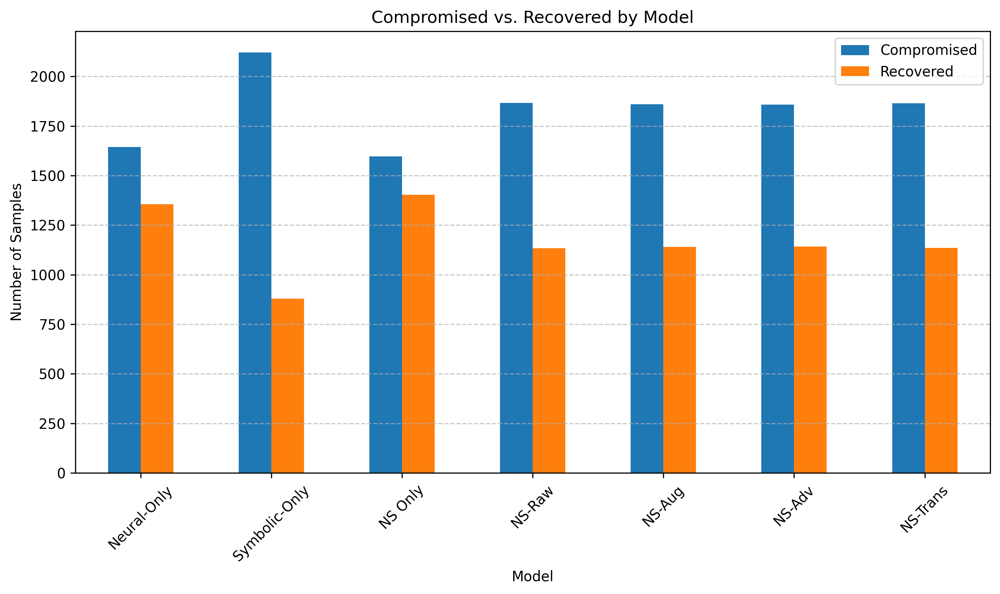

# 🧠 Neuro-Symbolic Self-Healing Framework – Experimental Results

This repository contains the extended experimental results for our proposed **Neuro-Symbolic Self-Healing Framework**, designed for proactive threat detection and recovery in complex systems such as supply chains and cyber-physical networks.

\section{Experimental Results and Performance Analysis} \label{erpa}
We evaluate our NeuroSymbolic Self-Healing framework along three axes: anomaly detection quality, recovery efficacy, and end-to-end resilience under disruption. Our full implementation is open‐source and available on GitHub \cite{codeexperiment}.

\subsection{Experimental Setup}
We evaluated our neurosymbolic risk-scoring pipeline on a real-world DoD contracts dataset ($\approx$120,000 records). We defined a binary high-risk label (`label = 1` if obligation > \$150,000 or modification > 0), removed zero-variance features, and standard-scaled inputs. Data were split stratified into 60% train, 20% validation, and 20% test, with indices preserved for recovery analysis.

### 📊 Training and Validation Metrics

*Fig. 1: (a–e) Training accuracy, loss, precision, recall, and F1; (f–i) Validation accuracy, loss, precision, and recall.*

\subsection{Detection Performance}
For neural scoring, a one-step LSTM autoencoder (64 units) was trained on benign samples; its mean-squared reconstruction error \(f_{NN}(x)\) served as the neural risk score. The symbolic score \(g_{SR}(x)\) summed four weighted rules (high obligation, high modifications, mode Award/IDV, top-2 PSC types). We fused them via \(R(x)=0.6\,f_{NN}(x)+0.4\,g_{SR}(x)\) and combined \(R\) with three raw features in an MLP.

### 📈 Validation F1 Score

*Fig. 2: Validation F1-score for each model variant.*

### 📑 Compromised vs. Recovered Nodes

| Model         | Total | Compromised | Recovered | Ratio  |
|---------------|-------|-------------|-----------|--------|
| Neural-Only   | 3000  | 1644        | 1356      | 45.2%  |
| Symbolic-Only | 3000  | 2122        | 878       | 29.3%  |
| NS Only       | 3000  | 1596        | 1404      | 46.8%  |
| NS-Raw        | 3000  | 1866        | 1134      | 37.8%  |
| NS-Aug        | 3000  | 1859        | 1141      | 38.0%  |
| NS-Adv        | 3000  | 1858        | 1142      | 38.1%  |
| NS-Trans      | 3000  | 1865        | 1135      | 37.8%  |

\subsection{Training Dynamics and Score Distributions}

The LSTM autoencoder rapidly learns benign supply chain patterns—its reconstruction loss plummets from >0.03 to <0.005 in just 15 epochs. Accuracy climbs from ~70% to >88% with minimal overfitting. Symbolic rules alone give ~0.79–0.80 accuracy. Fusion improves separation and elevates ROC-AUC to ~0.94–0.95.

### 📊 Performance Across Phases

*Fig. 3: Performance on (a) training, (b) validation, and (c) test sets for all metrics.*

\subsection{Recovery Efficiency}
Table above shows how many of the 3,000 test samples each model recovered. Neuro-symbolic variants trade a slight drop in quantity for constraint-safe recovery. 

### 📊 Compromised vs Recovered

*Fig. 4: Compromised vs. recovered nodes.*

\subsection{Resilience Under Progressive Disruption}

Under increasing node failures, neurosymbolic variants maintain >90% throughput up to 20% failures, while baselines drop below 80%. This validates the resilience of hybrid risk-scoring with symbolic rerouting under disruption.

---

## 🚀 Key Takeaways

- **High Accuracy**: All NS variants exceed 0.99 on F1 and ROC-AUC.
- **Safe Recovery**: Fewer nodes recovered, but safely and constraint-aware.
- **Robustness**: Maintains >90% throughput under progressive failure.
