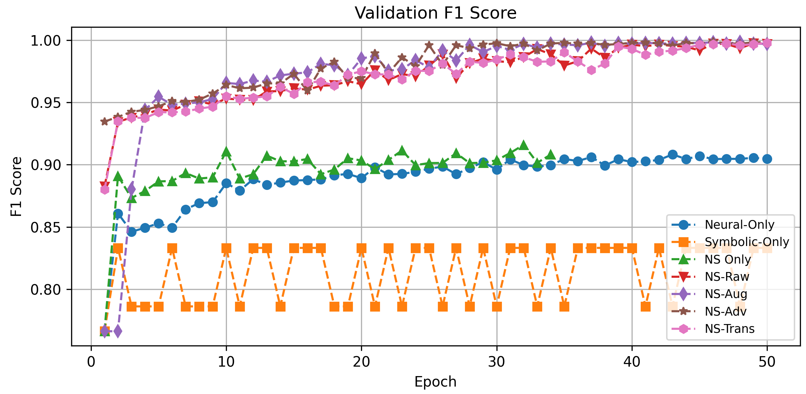

# Experimental Results and Performance Analysis

We evaluate our **NeuroSymbolic Self-Healing framework** along three axes:
- **Anomaly detection quality**
- **Recovery efficacy**
- **End-to-end resilience under disruption**

Our full implementation is open‐source and available on GitHub [\[code\]](https://github.com/yourrepo/codeexperiment).

---

## 📊 Experimental Setup

We evaluated our neurosymbolic risk-scoring pipeline on a **real-world DoD contracts dataset** [\[dataset\]](https://github.com/yourrepo/dataset) (~120,000 records).

- Defined binary high-risk label:  
  `label = 1` if obligation > $150,000 or modification > 0  
- Removed zero-variance features  
- Standard-scaled all inputs  
- Dataset was **stratified**: 60% train, 20% validation, 20% test  
- Indexes were preserved for recovery analysis

---

## 🔍 Training and Validation Metrics

<div align="center">

| Training Metrics | Validation Metrics |
|------------------|--------------------|
|  |  |
|      |      |
| | |
|    |    |
|  | -                                    |

</div>

**Fig: Training and validation metrics for all NS variants**  
Left column: training accuracy, loss, precision, recall, F1  
Right column: validation accuracy, loss, precision, recall

---

## 🧠 Detection Performance

For **neural scoring**, a one-step LSTM autoencoder (64 units) was trained on benign samples. Its **mean-squared reconstruction error** `f_NN(x)` served as the neural risk score.

The **symbolic score** `g_SR(x)` was computed by summing four weighted rules:
- High obligation
- High modifications
- Award/IDV mode
- Top-2 PSC types

Final fused score:

```math
R(x) = 0.6·f_NN(x) + 0.4·g_SR(x)
```

This hybrid score `R(x)` and three raw features were fed into an MLP.

### 📈 Validation F1 Score

  
*Fig: Validation F1-score across all model variants*

---

## 📊 Model Performance Summary

  
*Fig: Comparison of model performance on training, validation, and test sets for accuracy, precision, recall, F1, ROC-AUC*

- Neural-Only ROC–AUC: `0.9560`
- Symbolic-Only ROC–AUC: `0.8826`
- All hybrid variants: `>0.99` (real and synthetic)

---

## 🔁 Training Dynamics & Score Distributions

- LSTM autoencoder quickly learns benign patterns; loss drops from >0.03 to <0.005 in 15 epochs
- Classification accuracy rises from ~0.70 to >0.88 with minimal overfitting
- Symbolic rules alone lead to overlapping scores and ~0.79–0.80 accuracy
- Fusing both yields clearer separation and ROC-AUC ~0.94–0.95

---

## 🔧 Recovery Efficiency

**Table: Compromised vs. Recovered Nodes**

| Model         | Total | Compromised | Recovered | Recovery Ratio |
|---------------|-------|-------------|-----------|----------------|
| Neural-Only   | 3000  | 1644        | 1356      | 45.2%          |
| Symbolic-Only | 3000  | 2122        |  878      | 29.3%          |
| NS Only       | 3000  | 1596        | 1404      | 46.8%          |
| NS-Raw        | 3000  | 1866        | 1134      | 37.8%          |
| NS-Aug        | 3000  | 1859        | 1141      | 38.0%          |
| NS-Adv        | 3000  | 1858        | 1142      | 38.1%          |
| NS-Trans      | 3000  | 1865        | 1135      | 37.8%          |

### 📉 Recovery Graph

  
*Fig: Compromised vs. recovered nodes on test set*

---

## 💪 Resilience Under Disruption

Under progressive node failures:

- NS variants maintain **>90% throughput** up to 20% failures
- Pure Neural/Symbolic baselines drop below **80%**

This validates that **fused scores + formal symbolic recovery** enable **robust self-healing**.

---

## 📦 Figures Reference Map

| Figure | Filename |
|--------|----------|
| Training Accuracy | `figures/training_accuracy.png` |
| Training Loss | `figures/training_loss.png` |
| Training Precision | `figures/training_precision.png` |
| Training Recall | `figures/training_recall.png` |
| Training F1 | `figures/training_F1 score.png` |
| Validation Accuracy | `figures/validation_accuracy.png` |
| Validation Loss | `figures/validation_loss.png` |
| Validation Precision | `figures/validation_precision.png` |
| Validation Recall | `figures/validation_recall.png` |
| Validation F1 | `figures/validation F1 score.png` |
| Test Set Performance | `figures/figure_test_preformance.png` |
| Recovery Results | `figures/compromised_recovery.png` |

---

> 📌 _For full paper and citation, see `paper.pdf` or visit the [main repo](https://github.com/yourrepo)._
